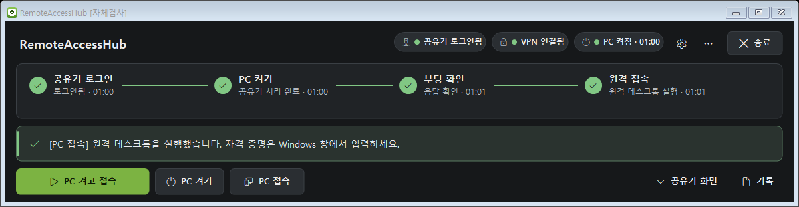
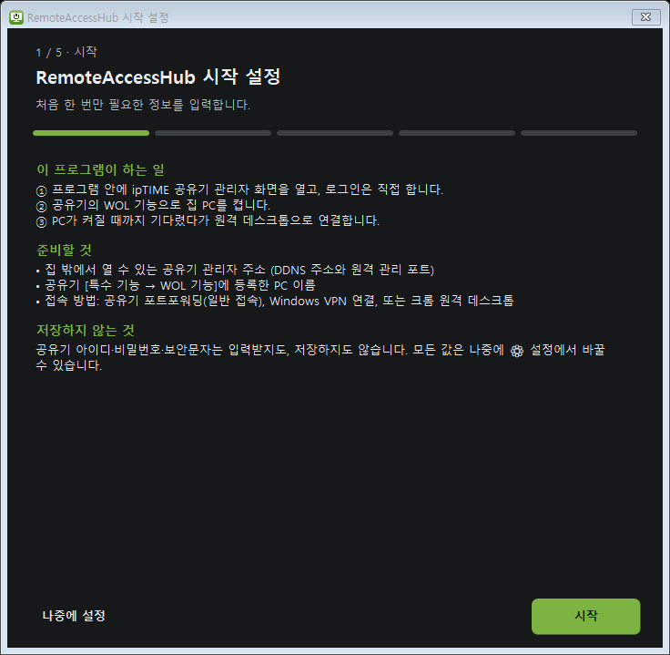
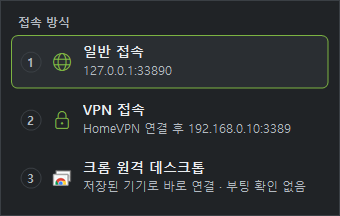

# RemoteAccessHub

집 밖 노트북에서 **ipTIME 공유기 WOL로 집 PC를 켜고 원격 데스크톱으로 접속**하는 과정을 한 창에 묶은 Windows 프로그램입니다.

공유기 로그인만 직접 하면, [PC 켜고 접속] 한 번으로 PC 켜기 → 부팅 확인 → 원격 데스크톱 실행까지 진행하고 네 단계의 진행 상황을 보여 줍니다.



| 시작 설정 | 접속 방식 고르기 |
| --- | --- |
|  |  |

> 캡처는 모두 내장 모의 공유기로 만든 화면입니다(127.0.0.1, `MY-PC`, `HomeVPN`은 예시 값).

## 하는 일

1. 프로그램 안에 ipTIME 관리자 화면을 엽니다. **아이디·비밀번호·보안문자는 사용자가 직접 입력**합니다. 프로그램은 대신 입력하지도, 저장하지도 않습니다.
2. 로그인이 확인되면 공유기 화면을 접고 [관리도구] 선택 화면을 자동으로 넘깁니다.
3. 공유기 WOL 목록에서 **설정한 PC 이름(과 MAC)이 정확히 맞는 행의 [PC 켜기]만** 누르고, 확인창의 [확인]을 누릅니다. 대상을 특정하지 못하면 아무것도 누르지 않습니다.
4. 일반 접속(포트포워딩) 또는 VPN 접속(Windows VPN)을 골라, RDP 포트가 응답할 때까지 기다린 뒤 `mstsc`를 실행합니다. VPN이 실패해도 일반 접속으로 멋대로 바꾸지 않습니다.
5. 또는 **크롬 원격 데스크톱**을 골라 그 기기의 연결 화면을 엽니다. 이 PC에 Chrome 원격 데스크톱 앱이 설치되어 있으면 앱 창으로, 없으면 기본 브라우저로 엽니다. 구글 로그인과 PIN은 직접 입력합니다.

## 주요 기능

- **첫 실행 시작 설정**: 공유기 주소 → 켤 PC → 접속 방법을 단계별로 입력하고 검사합니다.
- **접속 방식 세 가지**: 일반 접속(포트포워딩) · VPN 접속 · **크롬 원격 데스크톱**. 크롬 원격 데스크톱은 구글 서버가 중계하므로 포트포워딩·VPN이 필요 없고, 실제 화면 세션에 붙어 모니터 제어가 막히지 않습니다. 설치된 앱이 있으면 앱 창으로, 없으면 기본 브라우저로 엽니다.
- **PC 전원 상태 배지**: 설정한 주기로 포트 응답만 확인해 집 PC가 켜져 있는지 보여 줍니다. 응답이 없을 때 꺼졌다고 단정하지 않고 "응답 없음"으로만 표시합니다. 켜진 것이 확인되면 [PC 접속] 버튼이 서서히 밝아졌다 어두워집니다.
- **설정 내보내기·가져오기·초기화** (⚙ 설정 → 설정 파일)
- **상태 표시**: 공유기 로그인 · PC 켜기 · 부팅 확인 · 원격 접속을 따로 구분합니다. "버튼을 눌렀다", "공유기가 처리했다", "PC가 실제로 응답했다"를 섞지 않습니다.
- **[종료]**: 공유기 관리 세션을 로그아웃하고, 반영됐는지 확인한 뒤 종료합니다. VPN 연결은 끊지 않습니다.
- **기록·진단 파일**: 비밀번호·쿠키·세션 토큰·원본 HTML을 남기지 않고, 주소와 MAC은 가립니다.
- 어두운/밝은 테마, 단축키(Ctrl+Enter, Ctrl+Q 등)

## 요구 사항

| 항목 | 내용 |
| --- | --- |
| OS | Windows 10/11 x64 |
| 런타임 | [.NET 8 Desktop Runtime](https://dotnet.microsoft.com/download/dotnet/8.0) (x64), Microsoft Edge WebView2 Runtime (Windows 11에는 기본 포함) |
| 공유기 | ipTIME. **확인한 모델은 AX2004T (펌웨어 15.36.6)뿐입니다.** 관리 화면 구조가 다른 모델·펌웨어에서는 자동 조작이 동작하지 않을 수 있습니다(설정 → 고급에서 일부 조정 가능) |
| 공유기 준비 | 원격 관리 허용(집 밖에서 쓸 때), WOL 목록에 PC 등록 |
| 집 PC | 원격 데스크톱 허용, 포트포워딩 또는 VPN 서버 |
| 크롬 원격 데스크톱 (선택) | 대상 PC에 호스트 설치·로그인. 노트북에는 브라우저만 있으면 되고, [앱으로 설치]를 해 두면 앱 창으로 열립니다 |

## 설치와 실행

직접 빌드하거나 GitHub Actions의 빌드 결과물(서명 없음)을 받아 `RemoteAccessHub.exe`를 실행합니다. 처음 실행하면 시작 설정 창이 열립니다.

> **서명되지 않은 실행 파일입니다.** Windows SmartScreen이나 Smart App Control이 실행을 막을 수 있습니다. 보안 기능을 끄는 방법은 안내하지 않습니다. 이유와 신뢰된 서명에 필요한 것은 [docs/코드서명과배포.md](docs/코드서명과배포.md)를 보세요.

## 빌드

.NET 8 SDK가 필요합니다.

```powershell
.\build.ps1                    # 복원 + 빌드(Release) + 단위 검사
.\build.ps1 -Publish           # + artifacts\publish 에 실행 패키지와 zip 생성
.\build.ps1 -SelfTest          # + 모의 공유기 통합 자체검사(창과 WebView2가 잠시 뜸)
```

자세한 내용은 [docs/빌드방법.md](docs/빌드방법.md)에 있습니다.

## 검사

| 종류 | 내용 |
| --- | --- |
| 단위 검사 (xUnit) | WOL 대상 매칭(실기기 화면 구조 포함), 클릭 안전 검사, 입력 검증, 세션 판정, 접속 흐름, 크롬 원격 데스크톱 주소 조립·앱 찾기, 설정 내보내기·가져오기, 마스킹 등 |
| 통합 자체검사 (`--selftest`) | 실기기 특성을 흉내 낸 모의 ipTIME 공유기 + 실제 WebView2 + 실제 화면으로 로그인·WOL·확인창·접속(일반·VPN·크롬 원격 데스크톱)·종료·시작 설정 흐름을 검사 |

무엇을 실기기에서 확인했고 무엇이 아직 미검증인지는 [docs/검증기록.md](docs/검증기록.md)에 구분해 적었습니다.

## 문서

| 문서 | 내용 |
| --- | --- |
| [docs/사용안내.md](docs/사용안내.md) | 시작 설정, 설정 항목, 사용 순서, 문제 해결 |
| [docs/빌드방법.md](docs/빌드방법.md) | 빌드·검사·게시, 의존성 버전 |
| [docs/검증기록.md](docs/검증기록.md) | 검증 방법과 결과, 미검증 항목 |
| [docs/코드서명과배포.md](docs/코드서명과배포.md) | Smart App Control·SmartScreen 구분, 서명에 필요한 것 |

## 구조

```
src/RemoteAccessHub/
  Core/        설정, 로그(민감정보 가림), 세션 상태, 화면 판독 모델, WOL 대상 매칭
  Router/      WebView2 래퍼, 화면 판독 스크립트, WOL 자동화, 네트워크 관찰, 진단 내보내기
  Services/    VPN(rasdial/rasphone), TCP 포트 확인, 원격 데스크톱·크롬 원격 데스크톱 실행, 접속 흐름
  UI/          메인 창, 시작 설정, 설정 창, 단계 상태 모델, 테마, 아이콘
  UI/Controls/ 직접 그리는 버튼·단계 표시·상태 배지·안내 줄
  SelfTest/    모의 ipTIME 공유기, 가짜 VPN/포트/RDP, 자체검사 실행기
tests/         단위 검사
tools/         아이콘 생성 스크립트
```

## 안전 설계

- 공유기 비밀번호·보안문자·쿠키·세션 토큰을 설정 파일, 로그, 진단 파일 어디에도 기록하지 않습니다.
- 설정값은 형식을 검증한 뒤 `ProcessStartInfo.ArgumentList`로 넘깁니다. 셸 명령 문자열로 조립하지 않습니다.
- 인증서 검증을 전역으로 끄지 않습니다. 필요할 때만 "공유기 주소 한정" 허용을 고를 수 있습니다.
- 누르기 직전에 화면을 다시 읽어, 대상 버튼이 그 자리에 그대로 있고 다른 항목(예: 로그아웃) 위가 아닐 때만 누릅니다.
- 작업 취소나 종료가 기존 VPN 연결을 끊지 않습니다.

## 알려진 한계

- ipTIME 관리 화면(Flutter 웹)의 구조에 맞춰 조작하므로, 펌웨어가 바뀌면 동작하지 않을 수 있습니다.
- 공유기 로그인과 원격 데스크톱 자격 증명 입력은 자동화하지 않습니다(의도한 설계).

## 면책

이 프로젝트는 개인이 만든 비공식 도구이며 ipTIME(EFM Networks)과 관련이 없습니다. ipTIME은 해당 회사의 상표입니다. 공유기 설정을 바꾸는 기능은 없고 WOL 요청과 로그아웃만 보내지만, 사용에 따른 책임은 사용자에게 있습니다.

## 라이선스

[MIT License](LICENSE)
